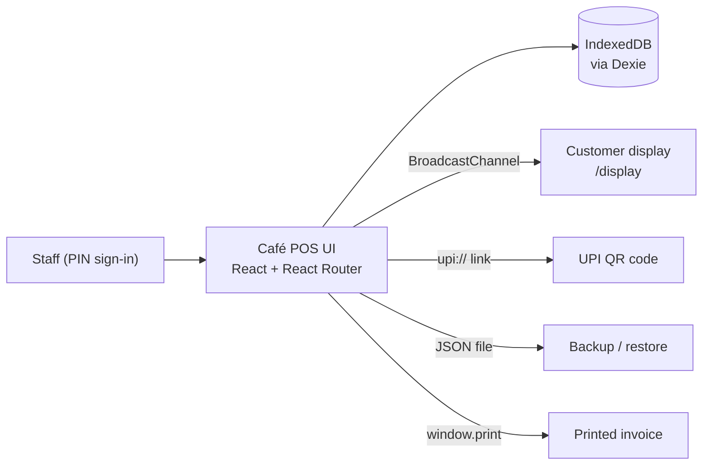

# ☕ Kadak & Co. — Café POS

### Chai, conversation, counter.

**A fast, offline-first point-of-sale for cafés.** Take dine-in, takeaway, and delivery orders, manage tables, bill with GST, accept cash, card, and UPI, track shifts and inventory, and run the whole counter from a single browser tab, with no backend required.

🔗 **Live demo:** [in-cafe-pos.netlify.app](https://in-cafe-pos.netlify.app/)

[Live demo](https://in-cafe-pos.netlify.app/) · [Report a bug](../../issues) · [Request a feature](../../issues)


---

## Table of contents

- [Highlights](#-highlights)
- [Features](#-features)
- [Design & theme](#-design--theme)
- [Staff roles & security](#-staff-roles--security)
- [Screens & routes](#-screens--routes)
- [Tech stack](#-tech-stack)
- [Architecture](#-architecture)
- [Data model](#-data-model)
- [Getting started](#-getting-started)
- [Backup & restore](#-backup--restore)
- [Limitations](#-limitations)
- [Roadmap ideas](#-roadmap-ideas)
- [Contributing](#-contributing)
- [License](#-license)

---

## ✨ Highlights

- ⚡ **Built for the counter:** quick picks, search, and barcode/SKU lookup keep orders fast
- 🧾 **GST-ready billing:** CGST/SGST breakdown, GSTIN, sequential invoice numbers, printable invoices
- 💳 **Cash, card, UPI, or split:** UPI QR codes generated from your UPI ID
- 🪑 **Table management:** floor view with statuses, guest counts, and table changes
- 👥 **PIN-based staff access:** role-based permissions and manager approval for sensitive actions
- 💾 **No server needed:** all data lives on the device in IndexedDB, with one-click backup and restore
- 🎨 **Coffee-inspired design:** a warm cream and espresso palette, elegant typography, and light and dark themes
- 📱 **Responsive:** works on counter tablets, desktops, and phones, with a sticky cart on small screens

---

## 🚀 Features

### Ordering

- Menu organized by **categories**, with **Quick Picks** and a searchable **All Items** view
- Items carry **SKU, barcode, price, diet tag (Veg / Non-veg / Egg)**, and a **bestseller** flag
- **Modifiers & notes** per line item, plus the ability to edit an item's notes or rate on the ticket
- **86 — mark items out of stock** instantly
- Three order types: **Dine In, Takeaway, Delivery**
- **Hold** an order and resume it later, **repeat** a previous order, or **void** an order (with confirmation)
- **Delivery details:** customer, address, and delivery notes
- **Guest count** for dine-in orders, adjusted with a simple **guest stepper**
- A **responsive product grid** that adapts to the screen size, with price tags and diet indicators
- A **sticky cart on mobile** so the current order is always visible
- Cart with item quantities, modifiers, subtotal, taxes, discounts, and grand total

### Tables & floor

- A **visual grid of tables** showing live status: **Available, Occupied, Reserved, Cleaning, and Bill Requested**
- Table **capacity**, and the ability to block a table so it can't be selected
- Pick a table for dine-in, **change table**, or **release a table** back to available
- Captain assignment display ("No Captain Assigned" when empty)

### Billing & invoices

- Subtotal, order-level **discount** (applied with manager approval), **CGST 2.5% + SGST 2.5%**, and grand total
- Configurable **GSTIN, invoice prefix, receipt footer, hours, and contact details**
- Invoice page per bill (`/invoice/:id`) that can be **printed**
- Business and **invoice logos** for branded receipts

### Payments

- **Cash** with change calculation, **Card**, **UPI**, or **Split** across tenders (for example cash + UPI)
- **UPI QR codes** built from a standard `upi://` payment link using your configured UPI ID and merchant name, with "Generate new QR" to refresh
- A dedicated **UPI payment flow** with a live status tracker: `waiting`, `paid`, `failed`, or `expired`
- An **invoice success screen** once payment completes
- **Demo mode** that simulates a UPI payment for testing
- **Refunds** with a reason, recorded against the original order and invoice

### Customer-facing display

- A second-screen view at `/display` that mirrors the current order and shows a thank-you screen after payment

### Shifts & cash control

- **Start shift** with opening cash
- **Close shift** by counting the drawer: the app shows **expected cash, actual cash, and variance**

### Customers & loyalty

- Customer records with phone, name, **visits, total spend, and loyalty points**
- Loyalty points accrue automatically on paid orders
- Track **dues and credit limits**, and save **favorite items**

### Inventory

- Track **ingredients** with unit, current stock, cost per unit, and **reorder level**
- A **"Needs attention"** view for low stock, and the option to **disable affected menu items**

### Reports

- At-a-glance **revenue, AOV (average order value), top items, and visits**
- Shift summaries and refund history

### Settings

Business · Menu · Staff · Payments · Billing · Branding · Appearance · Inventory · Reports · Customers · Data · Security

---

## 🎨 Design & theme

Kadak & Co. is designed to feel like a premium café brand, not a generic POS.

### Coffee-inspired palette

| Token | Used for |
|---|---|
| `cream` | Backgrounds and surfaces |
| `espresso` | Primary text and brand accents |
| `cardamom` | Success states (green) |
| `chili` | Errors and danger actions (red) |
| `marigold` | Warnings and highlights (yellow) |

### Typography

| Font | Used for |
|---|---|
| **Fraunces** | Elegant display headings |
| **Manrope** | Clean, readable UI text |
| **IBM Plex Mono** | Prices, numbers, and receipts |

### Themes & responsiveness

- **Light and dark modes** that follow your system preference, or can be set manually in **Settings → Appearance**
- Fully responsive layouts, from counter tablets to phones, including a **sticky cart** on small screens

---

## 🔐 Staff roles & security

Staff sign in on a **lock screen** ("Who's on counter?") with **staff tiles** and a **PIN keypad**; entered digits show as dots. Roles control what each person can do:

| Role | Typical use |
|---|---|
| `admin` | Full access, including settings, staff, and data |
| `manager` | Approvals (discounts, voids, refunds), reports, shift oversight |
| `cashier` | Taking orders and payments |
| `captain` | Floor and table service |
| `viewer` | Read-only access |

- **Lock POS** to keep the session while stepping away, or **Switch user** to sign in as someone else
- Sensitive actions (discounts, voids, refunds) can require **manager approval**
- Permissions are checked per action inside the app

> ⚠️ **Staff PINs are stored on the device and checked in the browser.** This is convenient for a counter setup but is not a substitute for server-side security. Change the demo PINs before real use, and see [Limitations](#-limitations).

---

## 🧭 Screens & routes

| Route | Screen |
|---|---|
| `/` | POS: menu, ticket, and tables |
| `/orders` | Order list (open, held, paid, all) |
| `/pay` | Payment screen |
| `/display` | Customer-facing display |
| `/invoice/:id` | Printable invoice |
| `/profile` | Current staff profile, shift, and lock/switch user |
| `/settings` | Settings home |
| `/settings/:section` | A specific settings section (business, menu, staff, payments, and so on) |

---

## 🏗️ Tech stack

| Layer | Technology |
|---|---|
| **UI** | React 19 |
| **Routing** | React Router |
| **Local database** | Dexie.js on IndexedDB |
| **Styling** | Custom CSS with theme tokens for light and dark modes |
| **Fonts** | Fraunces, Manrope, IBM Plex Mono |
| **Icons** | Lucide |
| **Build tooling** | Vite |
| **Session state** | `sessionStorage` (signed-in staff), `localStorage` (current order) |

---

## 🏛️ Architecture

Everything runs in the browser. There is no server, API, or cloud database.



---

## 🗄️ Data model

The local database (`kadak-co-pos`) is organized into these tables:

| Table | Holds |
|---|---|
| `business` | Name, tagline, contact, GSTIN, invoice prefix and sequence, UPI settings, branding |
| `staff` | Staff members, PINs, roles, and status |
| `categories` | Menu categories and sort order |
| `items` | Menu items with SKU, barcode, price, diet, quick-pick and availability flags |
| `ingredients` | Inventory items, stock levels, and reorder points |
| `floor` | Tables with number, status, and capacity |
| `orders` | Orders with type, status, table, customer, and totals |
| `payments` | Payments and split tenders per order |
| `invoices` | Invoice numbers and links to orders |
| `customers` | Customer records, loyalty, dues, and favorites |
| `shifts` | Opening and closing cash per shift |
| `refunds` | Refunds linked to orders and invoices |
| `meta` | App-level key/value settings |

---

## 🚀 Getting started

### Prerequisites

- Node.js 18+ and npm
- A modern browser (Chrome, Edge, or Safari recommended)

### 1. Clone and install

```bash
git clone <your-repository-url>
cd <your-project-folder>
npm install
```

### 2. Run locally

```bash
npm run dev
```

No environment variables or backend setup are required.

### 3. Build for production

```bash
npm run build
npm run preview
```

The output in `dist/` is a static site and can be hosted anywhere (Netlify, Vercel, GitHub Pages, or a local web server on the counter machine). The [live demo](https://in-cafe-pos.netlify.app/) is hosted on Netlify.

> Because the app uses client-side routes (`/orders`, `/pay`, `/settings`, and so on), configure your host to serve `index.html` for all paths. On Netlify, add a `public/_redirects` file containing `/*  /index.html  200`.

### 4. First run

1. Open the app and sign in using one of the demo PINs shown on the lock screen.
2. Go to **Settings → Business** and enter your café's details, GSTIN, and invoice prefix.
3. Go to **Settings → Payments** and enter your **UPI ID** and merchant name.
4. Go to **Settings → Menu** and **Staff** to replace the demo menu and PINs with your own.
5. Start a shift with your opening cash and take your first order.

---

## 💾 Backup & restore

Because all data lives in the browser, **backups matter.**

- **Settings → Data → Download backup** saves everything as a JSON file named `kadak-backup-<timestamp>.json`
- **Restore from file** replaces all current data with the backup, after a confirmation prompt

Download a backup at the end of every day and before clearing browser data, switching browsers, or changing devices.

---

## ⚠️ Limitations

Be aware of these before using the app in a real café:

- **Single device:** data is stored in one browser on one device. There is **no cloud sync** and no multi-terminal support.
- **Data loss risk:** clearing site data, using a private window, or losing the device erases everything not backed up.
- **UPI payments are not verified:** the app generates a payment QR, but there is **no bank or payment-gateway integration.** Confirm receipt in your UPI app before marking a bill paid. "Simulate payment" is for demo and testing only.
- **Card payments are manual:** the app records the sale; the card itself is processed on your separate terminal.
- **Client-side security:** PINs and permissions are enforced in the browser and are not tamper-proof.
- **Tax rates:** invoices use CGST 2.5% + SGST 2.5%. Check this against your own GST requirements and consult your accountant.

---

## 🔮 Roadmap ideas

- [ ] Multi-device sync with a cloud backend
- [ ] Kitchen display / KOT printing
- [ ] Real UPI payment confirmation via a gateway
- [ ] Configurable tax slabs per item
- [ ] CSV / Excel export for reports
- [ ] Installable PWA with a service worker
- [ ] Thermal printer support
- [ ] Hashed PINs and stronger access control

---

## 🤝 Contributing

1. Fork the repo and create a branch: `git checkout -b feature/your-feature`
2. Keep changes consistent with the local-first design (all data through Dexie)
3. Open a pull request describing what changed and why

---

## 📄 License

Add your license here and include a `LICENSE` file in the repository.

---

<p align="center"><b>Kadak & Co.</b> · Café POS<br/>Chai, conversation, counter.</p>
